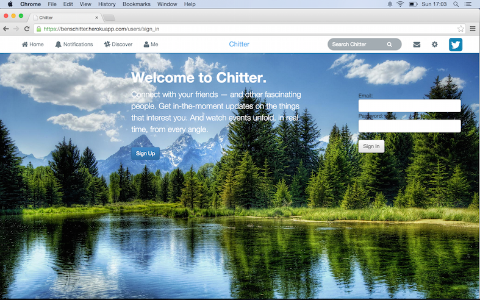
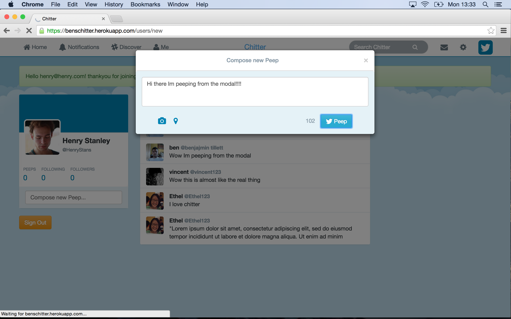
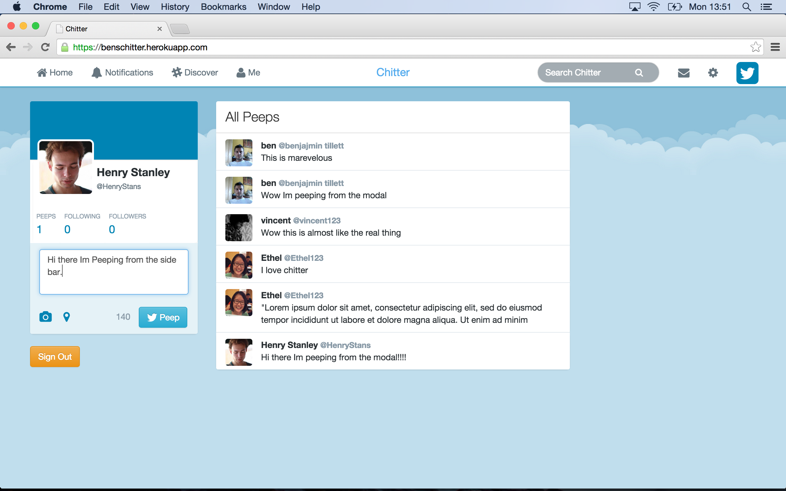
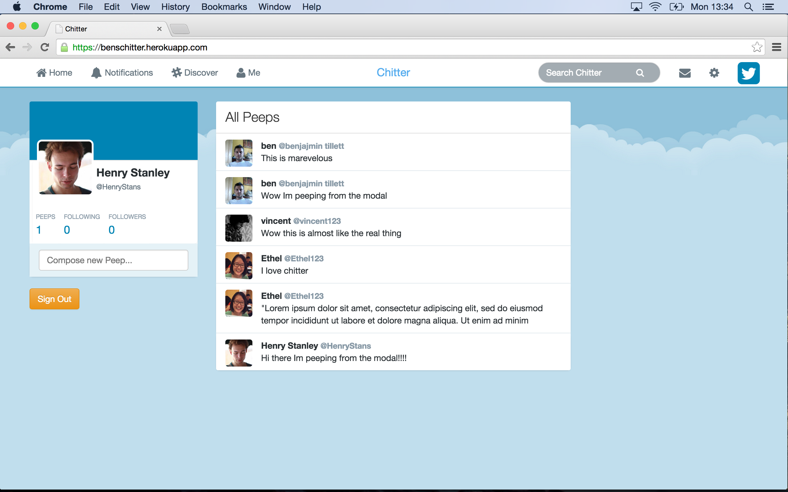

FRIDAY CHALLENGE 5 - CHITTER
=============================

@ Makers Academy
----------------

A twitter clone written in ruby using rspec, cucumber, sinatra and capybara and A first introduction to databases using datamapper and postgres. 

####The app involved using many new concepts and skills including:

> *	 Persisting users and peeps in the database.
> *  One to many relationships between users and tweets. 
> *  User authentication and tracking with Bcrypt and sessions

[Click here](https://benschitter.herokuapp.com/users/sign_in) to check it out online

Skills learnt/used
-----------------
> * ruby  
> * rspec
> * datamapper
> * postgress
> * ruby  
> * rspec
> * capybara
> * bootstrap
> * HTML5
> * CSS3


On the site
-----------




Click to sign up


Make sure you choose a unique email address



Try peeping from the modal



Or the sidebar



Go to the homepage to view all user peeps.


How to use
----------

Clone the repository:

```shell 
$ git clone git@github.com:benjamintillett/chitter.git
```

Run the tests:

```shell 
$ cd chitter
$ rspec
```
Or load the server locally

```shell 
$ rackup
```

And point the browser to localhost:9292


